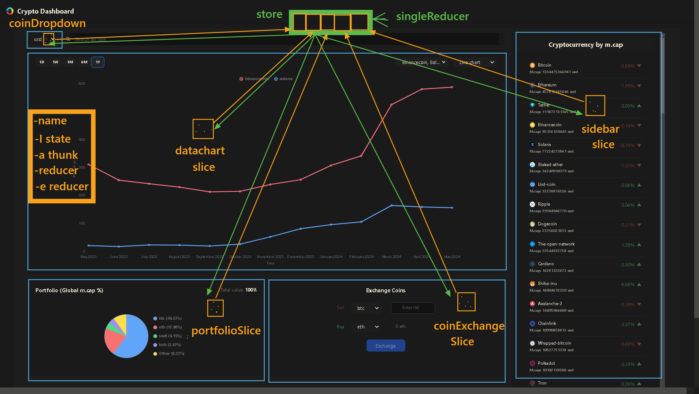

# Crypto Dashboard

[Crypto Dashboard Live](https://crypto-dashboard-sharath.netlify.app/)

## Table of Contents

- [Introduction](#introduction)
- [Features](#features)
- [Installation](#installation)
- [Contributing](#contributing)
- [Contact](#contact)
- [Demo/Screenshots](#demoscreenshots)

Through this web application, you can see real-time data of cryptocurrencies and visualize them through charts. To see the application live, you can directly jump to this link: [Crypto Dashboard Live](https://crypto-dashboard-sharath.netlify.app/). If you’d like to know more about the project, then the content below is for you, my friend :).

## Introduction

This project is a front-end project submitted to Almabetter. It aims to provide you with up-to-date information and visualizations of various cryptocurrencies. The application fetches data from the CoinGecko API and displays it in an intuitive and user-friendly interface.

## Features

This application provides you with:

- Interactive charts and graphs for visualizing price trends
- Real-time data updates for popular cryptocurrencies (sorted by market cap)
- Exchange rates of various cryptocurrencies
- Search functionality for specific cryptocurrencies and visualization of their data
- User-friendly interface with a responsive design

## Project Folder Structure

In order to provide all the above features, we need the code to be well organized. For that, I used a feature-based approach, where related components and Redux state slices are kept in a single folder as shown in the image below:


## Installation

If you’d like to get the code and run it on your computer, then you can follow the steps below:

1.  Firstly, you need to clone the repository by hitting this command in your terminal:

    ```bash
    git clone https://github.com/Sharatdevadiga/crypto-dashboard.git
    ```

2.  Then navigate to the project directory:

    ```bash
    cd crypto-dashboard-vite
    ```

3.  Finally, install the dependencies, and you are good to go!

    ```bash
    npm install
    ```

4.  Oh! Hold on, you also have to start the development server to see the project in action:

    ```bash
    npm run dev
    ```

5.  Finally (I know I already said this word, but trust me :), this is the last step), open your browser and visit `http://localhost:3000` to access the web page in your browser.

## Contributing

If you have any ideas, suggestions, or bug reports, please open an issue or submit a pull request. Or if you’d like to share...

## Contact

Share your thoughts with me on:

1.  linkdin -> www.linkedin.com/in/sharath-devadiga
2.  email -> sharathdevadiga0046@gmail.com

HAVE A NICE DAY :)

## Demo/Screenshots

1. App Layout
   

2. Data Visualization
   
   

3. Search Bar (highlighted)
   

4. Coin Exchange and Portfolio (highlighted)
   

5. Dropdown and Loader
   

6. Responsive Design
   



