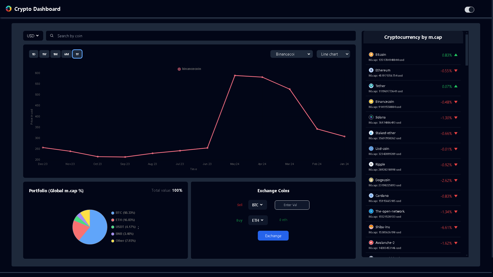
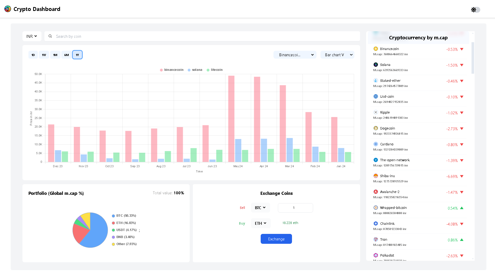
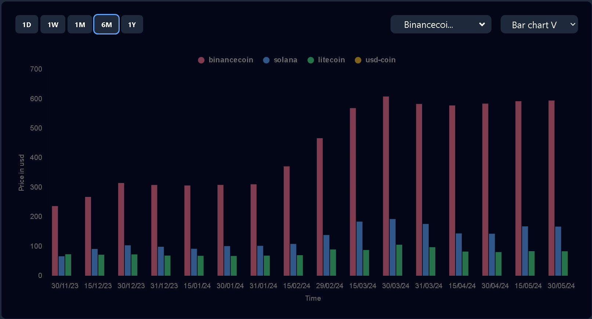
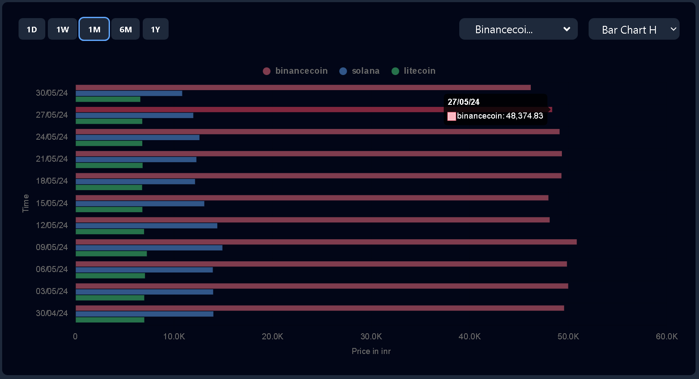
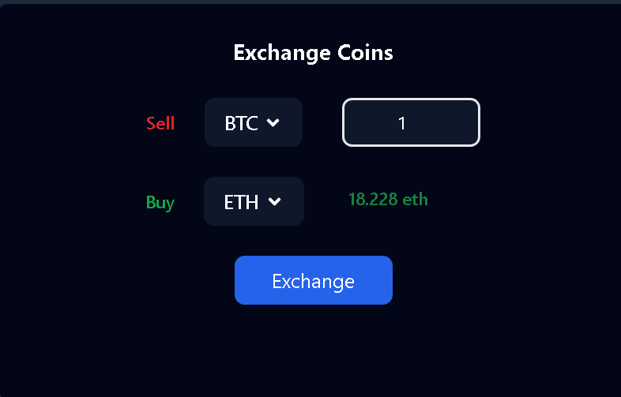
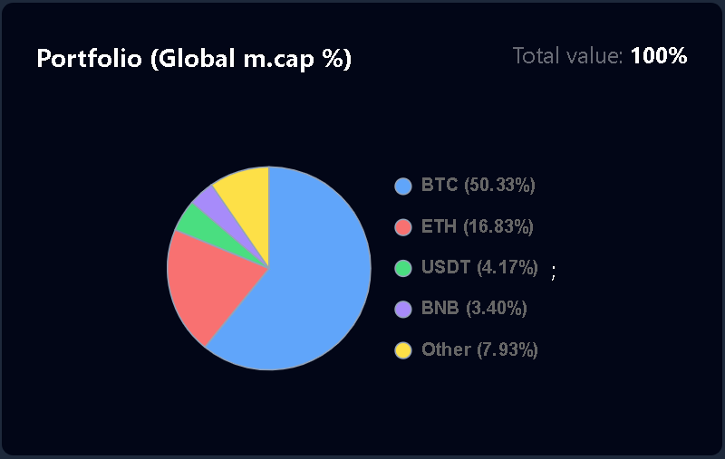
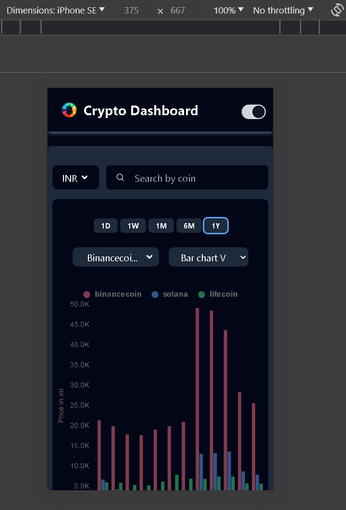
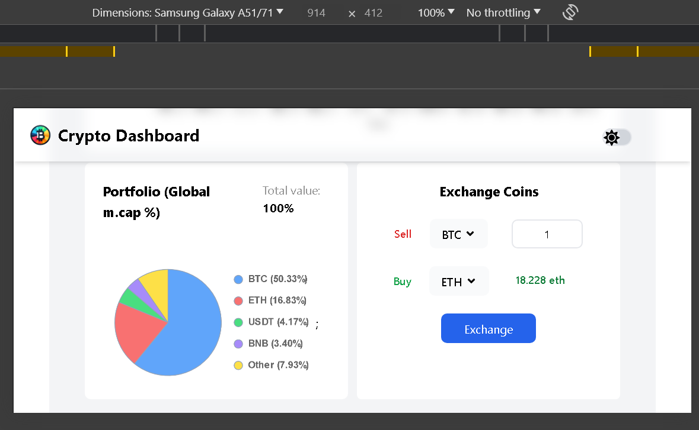
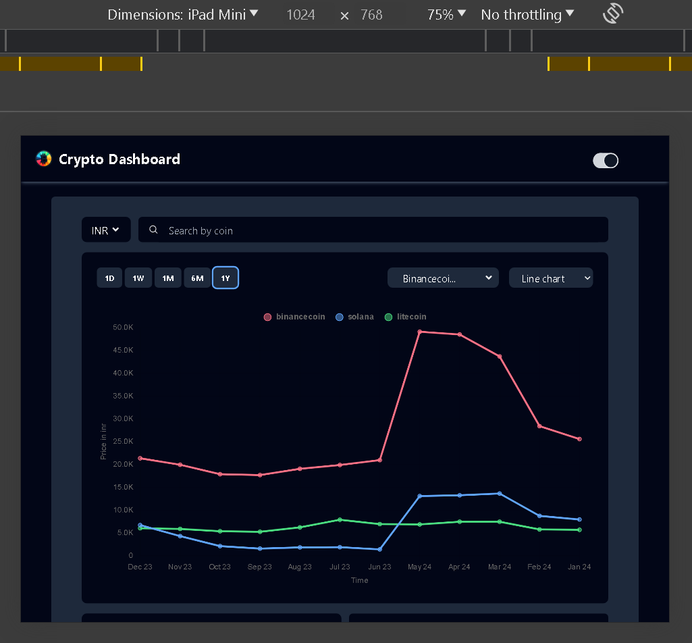
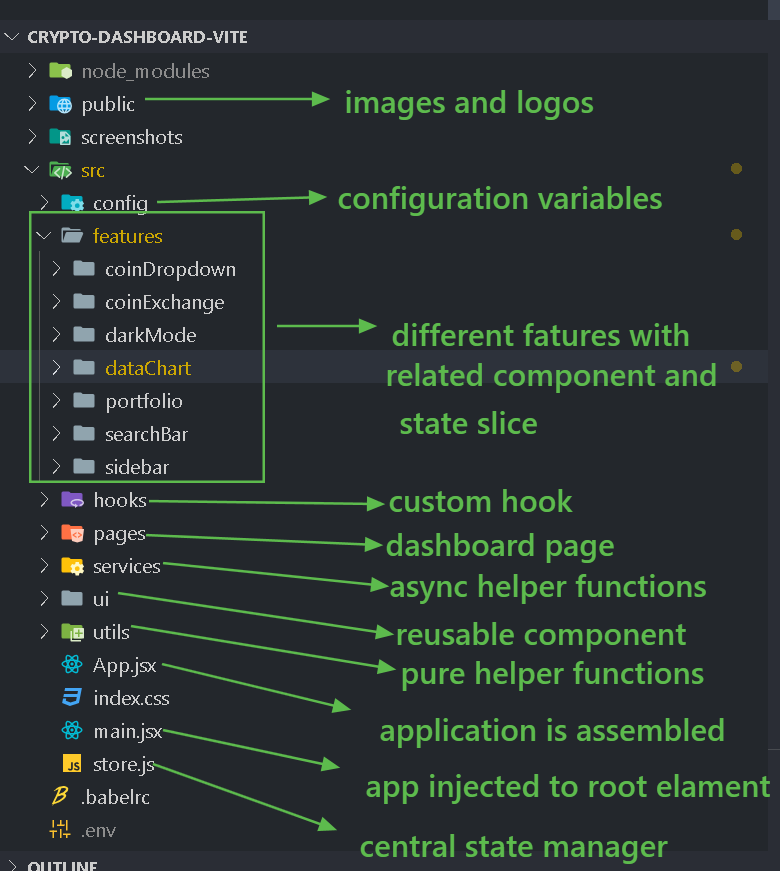

# Crypto Dashboard

Through this web application, you can see real-time data of cryptocurrencies and visualize them through charts. To see the application live, you can directly jump to this link: [Crypto Dashboard Live](https://crypto-dashboard-sharath.netlify.app/). If you’d like to know more about the project, then the content below is for you.

## Table of Contents

- [Introduction](#introduction)
- [Framework / Dependencies](#framework--dependencies)
- [Features And Demo](#features-and-demo)
- [Project Folder Structure](#project-folder-structure)
- [Installation](#installation)
- [Contributing](#contributing)
- [Contact](#contact)

## Introduction

This project is a front-end project submitted to Almabetter. It aims to provide you with up-to-date information and visualizations of various cryptocurrencies. The application fetches data from the CoinGecko API and displays it in an intuitive and user-friendly interface.

## Framework / Dependencies

1. [ReactJS](https://reactjs.org/) - core of the application
2. [Redux-thunk](https://github.com/reduxjs/redux-thunk) - for asynchronous data fetching
3. [Redux-toolkit](https://redux-toolkit.js.org/) - for state management
4. [TailwindCSS](https://tailwindcss.com/) - for Layout and styling
5. [Chart.js](https://www.chartjs.org/) - for data visualization
6. [React-chartjs-2](https://react-chartjs-2.js.org/) - for data visualization
7. [Coingecko API](https://www.coingecko.com/en/api/documentation)- for data

## Features And Demo

### Features

This application provides you with:

- Interactive charts and graphs for visualizing price trends
- Real-time data updates for popular cryptocurrencies (sorted by market cap)
- Exchange rates of various cryptocurrencies
- Search functionality for specific cryptocurrencies and visualization of their data
- User-friendly interface with a responsive design
- Dark Mode

### Demo

1.  App Layout
    a. App Layout - Dark mode
    

    2.App Layout - Light mode
    

2.  Data Visualization -> you can select different charts(line/ barH/ barV), different timeperiod(1D, 1W, 1M 6M or 1Y), You can also select upto 4 charts at a time to compare them side by side in the same chart. You can also search for a specific crypto currenct in the search bar

    a. Line chart - With 1 year data and 3 plots
    

    b. Vertical Bar chart - With 6Months data
    

    c.Horizontal Bar chart - With 1Month Data
    
    

3.  Coin Exchange and Portfolio- With coin Exchange block you can know exchange rate between different coins. And with portfolio, you can visualize the M.cap% of top 4 crypto currencies.

    a. CoinExchange
    

    b. Portfolio
    

4.  Side bar - This feature lists down the major cryptocurrencies sorted by M.cap
    

5.  Responsive Design
    a. Mobile - Vertical
    

    b. Mobile - Horizontal
    

    c.Tab
    

## Project Folder Structure

In order to provide all the above features, we need the code to be well organized. For that, I used a feature-based approach, where related components and Redux state slices are kept in a single folder as shown in the image below:


## Installation

If you’d like to get the code and run it on your computer, then you can follow the steps below:

1.  Firstly, you need to clone the repository by hitting this command in your terminal:

    ```bash
    git clone https://github.com/Sharatdevadiga/crypto-dashboard.git
    ```

2.  Then navigate to the project directory:

    ```bash
    cd crypto-dashboard-vite
    ```

3.  Finally, install the dependencies, and you are good to go!

    ```bash
    npm install
    ```

4.  Oh! Hold on, you also have to start the development server to see the project in action:

    ```bash
    npm run dev
    ```

5.  Finally (I know I already said this word, but trust me :), this is the last step), open your browser and visit `http://localhost:3000` to access the web page in your browser.

## Contributing

If you have any ideas, suggestions, or bug reports, please open an issue or submit a pull request. Or if you’d like to share...

## Contact

Share your thoughts with me on:

1.  linkdin -> www.linkedin.com/in/sharath-devadiga
2.  email -> sharathdevadiga0046@gmail.com

          HAVE A NICE DAY :)
